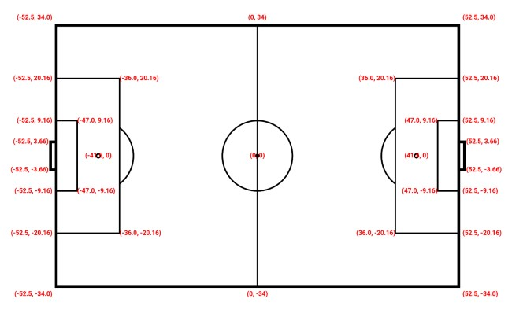

# DES MIT Submission

## General Information

This repository contains a description of the data and provides access to the datasets required to reproduce the analyses presented in our submission to the MIT Sloan Sports Analytics Conference 2027.

## Dataset access

Due to the size of the datasets, the data files are not hosted directly in this GitHub repository.

The datasets required to reproduce the analyses can be accessed at the following link:

[Click here to access the data](https://drive.google.com/drive/folders/1HZcvxo2JMTSAbIYN3lLH5D_fqyCm-G05?usp=sharing)

## Dataset description

The datasets used in this project combine tracking and event data provided by Gradient Sports for footed open-play passes and crosses in the Premier League 2024/2025 and 2025/2026 seasons.

The 2024/2025 dataset is used to train the machine learning models, while the 2025/2026 dataset is reserved for out-of-sample model evaluation and all subsequent analyses.

Each row in the dataset represents one pass or cross and contains the corresponding event and tracking information.

Tracking coordinates are rotated such that the team in possession—i.e., the team making the pass or cross—always plays from left to right. The coordinate system is centered at `(0, 0)`. For a standard pitch of 105 × 68 meters, the coordinate system is illustrated below.

The dataset contains the variables `pitch_length` and `pitch_width` for each observation, indicating the actual dimensions of the pitch. These could in principle be used to standardize coordinates across pitches. However, we retain coordinates in their original metric scale so that spatial features, such as distance to goal, can be calculated consistently in meters.

The raw tracking data provided by Gradient Sports is smoothed using a Savitzky–Golay filter.

### Variables

| Variable | Description |
|---|---|
| `season_id` | Season identifier: `1` for the Premier League 2024/2025 season and `2` for the Premier League 2025/2026 season. |
| `match_id` | Unique identifier for each match. |
| `frame` | Tracking-data frame corresponding to the event. |
| `period` | Match period in which the event occurs: `1` = first half, `2` = second half. |
| `event` | Event type: `pass` or `cross`. |
| `passer_id` | Unique identifier of the player making the pass or cross. |
| `passer_team` | Indicator for the passer's team: `1` if the passer belongs to the home team and `0` if the passer belongs to the away team. |
| `receiver_slot` | Intended receiver of the pass according to the human-labeled event data provided by Gradient Sports. For example, `att_9` indicates that `x_att_9` and `y_att_9` contain the coordinates of the intended receiver. The intended receiver is always an attacking (`att_*`) player. Although an intended receiver cannot always be identified for passes and crosses in general, this dataset contains only observations for which an intended receiver is available. |
| `actual_receiver_slot` | Player who actually receives or next touches the ball. For successful passes, this is often equal to `receiver_slot`, but it need not be, since a different teammate may receive the ball than the intended target. For unsuccessful passes, this is typically the defending player who intercepts or gains possession. If the ball goes out of play, it corresponds to the player who next restarts play, such as the goalkeeper taking a goal kick or the player taking a throw-in. In rare cases where the ball goes out of play at the end of the match, this field is `NA`. |
| `out` | Indicator for whether the pass or cross goes out of play: `1` if it goes out of play and `0` otherwise. |
| `pass_successful` | Indicator for whether the pass or cross is successful: `1` if the next touch is by a player on the same team as the passer and `0` otherwise. |
| `pass_start_x`, `pass_start_y` | x- and y-coordinates of the passer at the moment the pass or cross is played. Consequently, `pass_start_x` and `pass_start_y` also represent the passer's position; separate positional columns for the passer are therefore not included. |
| `pass_end_x`, `pass_end_y` | x- and y-coordinates of the player who next touches the ball, measured at the moment of that touch. |
| `curr_poss_start_x`, `curr_poss_start_y` | x- and y-coordinates at which the passer received the ball at the beginning of their current possession. For first-touch passes, these are equivalent to `pass_start_x` and `pass_start_y`. |
| `prev_poss_end_x`, `prev_poss_end_y` | x- and y-coordinates at the end of the preceding player's possession, before the current passer receives the ball. |
| `duration_curr_poss` | Time in seconds between the passer receiving the ball and playing the pass or cross. This is `0` for first-touch passes. |
| `duration_prev_to_curr` | Time in seconds between the end of the preceding player's possession and the moment the current passer receives the ball. |
| `vx_passer`, `vy_passer` | Velocity of the passer in the x- and y-directions at the moment of the pass, measured in meters per second (m/s). |
| `x_att_gk`, `y_att_gk` | x- and y-coordinates of the goalkeeper of the attacking team at the moment of the pass. |
| `vx_att_gk`, `vy_att_gk` | Velocity of the attacking team's goalkeeper in the x- and y-directions at the moment of the pass, measured in m/s. |
| `x_att_1`–`x_att_9`, `y_att_1`–`y_att_9` | x- and y-coordinates of the nine outfield teammates of the passer at the moment of the pass. If the passing team has fewer than 11 players on the pitch, for example following a red card, one or more player slots may be `NA`. |
| `vx_att_1`–`vx_att_9`, `vy_att_1`–`vy_att_9` | x- and y-direction velocities of the nine outfield teammates of the passer at the moment of the pass, measured in m/s. If the passing team has fewer than 11 players on the pitch, one or more player slots may be `NA`. |
| `x_def_gk`, `y_def_gk` | x- and y-coordinates of the goalkeeper of the defending team at the moment of the pass. |
| `vx_def_gk`, `vy_def_gk` | Velocity of the defending team's goalkeeper in the x- and y-directions at the moment of the pass, measured in m/s. |
| `x_def_1`–`x_def_10`, `y_def_1`–`y_def_10` | x- and y-coordinates of the ten outfield players of the defending team at the moment of the pass. If the defending team has fewer than 11 players on the pitch, for example following a red card, one or more player slots may be `NA`. |
| `vx_def_1`–`vx_def_10`, `vy_def_1`–`vy_def_10` | x- and y-direction velocities of the ten outfield players of the defending team at the moment of the pass, measured in m/s. If the defending team has fewer than 11 players on the pitch, one or more player slots may be `NA`. |
| `xG_for` | Expected goals (xG) generated by the team making the pass during the 20 seconds following the pass. If multiple shots occur within this window, they are combined while accounting for a maximum of one goal, using the probability that at least one of the shots results in a goal. An `NA` value indicates genuinely missing information and should not be interpreted as zero. |
| `xG_against` | Expected goals (xG) generated by the team defending at the time of the pass during the subsequent 20 seconds. Multiple shots are combined in the same manner as for `xG_for`. An `NA` value indicates genuinely missing information and should not be interpreted as zero. |
| `xG_net` | `xG_for` - `xG_against` |
| `pitch_width` | Width of the pitch in meters. |
| `pitch_length` | Length of the pitch in meters. |

## License

This repository is licensed under the Creative Commons
Attribution-NonCommercial 4.0 International License (CC BY-NC 4.0).

You may share and adapt the material for non-commercial purposes,
provided that appropriate attribution is given and the terms of the
license are followed.

For the full license terms, see the LICENSE file or:
https://creativecommons.org/licenses/by-nc/4.0/
